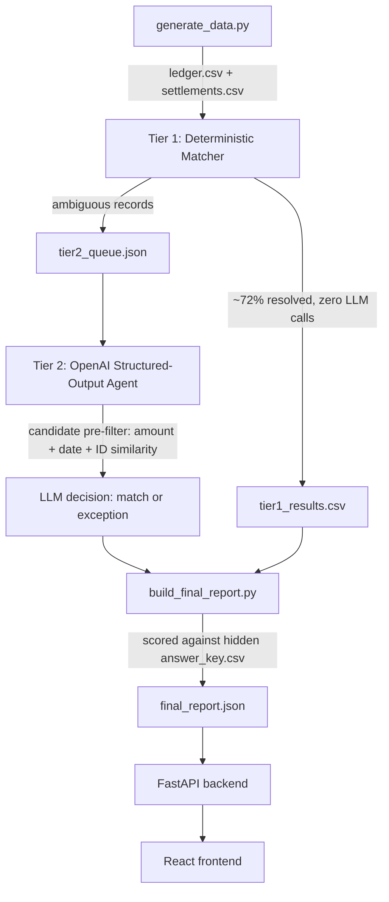

# AI Finance Controller — Multi-Source Reconciliation Agent

Built for the Razorpay Buildathon (AI Finance Controller track). Closes one finance-ops
loop end to end: reconciling an internal ledger against a Razorpay-style settlement
report across a 65-record synthetic batch, and reporting an honest match rate plus
every exception it could not resolve.

**Live demo:** `https://ai-finance-controller-api.onrender.com` (backend API — see `/docs`
for interactive endpoint testing) · frontend deployed on Netlify

---

## The result, up front

Run against a fresh synthetic batch (regenerated on every run, so this isn't a
cherry-picked fixture):

| Metric | Value |
|---|---|
| Total ledger records | 65 |
| Match rate | **89.2%** (58 / 65) |
| Resolved by deterministic code (tier 1) | 47 (72.3%) |
| Resolved by LLM agent (tier 2) | 11 |
| Honest exceptions | 7 |
| **Measured precision of matches** | **0.983** |
| **Measured recall of matches** | **1.0** |
| **Measured overall accuracy** | **0.985** |

The precision/recall/accuracy numbers aren't asserted — they're computed by scoring
every decision against a hidden ground-truth answer key that the matcher itself never
sees (`answer_key/answer_key.csv`, generated alongside the data but excluded from every
matching step). This is the honest version of "measured accuracy": run
`python3 matcher/build_final_report.py` yourself and it recomputes these from scratch
against a newly generated batch.

---

## Why this problem, this way

Reconciliation is where "throughput + measured accuracy + honest exceptions" is
directly testable — a match either holds up against a real fee/tax model or it doesn't,
and there's no room to fudge the exception count. That made it a better fit than a
forecaster (no ground truth to validate against in a two-week build) or a pure
settlement Q&A agent (a thin LLM wrapper doesn't demonstrate engineering judgment about
where reasoning is actually needed).

The scenario: a business reconciling its internal invoice ledger against a Razorpay
settlement report, where settlements are net of a ~2% processing fee plus 18% GST on
that fee, and land with realistic mess — typos, delayed settlement, split payouts,
duplicate export rows, and orphaned refunds.

---

## Architecture



**Tier 1 — deterministic, no model call.** Exact `payment_id` match, dedup identical
settlement rows, recompute the expected net amount from the fee/tax model, compare
within a rupee tolerance. This resolves the majority of records through arithmetic
alone — an LLM would be slower, non-deterministic, and unnecessary here.

**Tier 2 — OpenAI, only where reasoning is actually needed.** Records tier 1 can't
close (no exact ID match, multiple settlement candidates for one invoice, or an amount
that doesn't line up) go through a deterministic candidate pre-filter first (amount
proximity + date proximity + string similarity narrows the field), then to an LLM call
with a **strict JSON schema** (`decision`, `matched_settlement_ref`, `confidence`,
`reason_code`, `explanation`). The model is never allowed to return free text, and a
low-confidence case is required to come back as `decision: exception` rather than guess.

**Where AI was deliberately not used:** ID/amount dedup, tolerance-band matching, and
duplicate-row collapsing are all pure code. Using an LLM there would add latency and
non-determinism to a task that's just arithmetic — the wrong tool for the job.

**Failure isolation:** if the OpenAI call fails or returns something unparseable, the
record becomes an honest exception (`reason_code: llm_call_failed`) instead of crashing
the batch or silently dropping the record. Nothing is ever lost between tiers.

---

## Exception taxonomy

Every unresolved record gets a specific reason code, not a generic "no match":

`fuzzy_id_typo` (resolved) · `split_settlement_confirmed` (resolved) ·
`amount_mismatch_unexplained` · `unsettled_pending` · `orphan_no_invoice` ·
`insufficient_evidence` · `llm_call_failed`

---

## Failure recovery — what broke, and what we did about it

Four real bugs were found by cross-checking the pipeline's output against the hidden
answer key during development, not by inspection:

1. **No-op typos.** The fuzzy-ID generator occasionally swapped two identical adjacent
   digits (e.g. `44`), producing no actual change — silently turning intended
   fuzzy-match test cases into accidental clean matches. Fixed by rejecting any typo
   that doesn't change the string.

2. **ID collisions.** Because order IDs are small sequential numbers, a random digit
   transposition could land exactly on a *different*, real order ID already in the
   batch — merging two distinct ground-truth records into one ambiguous ID. Fixed by
   reserving the full ID number-space up front and rejecting any typo that collides
   with a real ID.

3. **Split-settlement key mismatch (the significant one).** The data generator tagged
   split settlement legs with `_a`/`_b` suffixes, but the tier-1 matcher's
   "multiple candidates" branch — the code specifically written to detect and resolve
   splits — only fires on an *exact* `payment_id` match. Every split-settlement test
   case was silently routed into the wrong queue with no code path built to sum two
   legs. This was a real integration bug between two files written independently, not
   caught until the answer-key cross-check flagged unexpected misclassifications.
   Fixed by aligning the generator's contract with the matcher's: both settlement legs
   now carry the same `payment_id` as the ledger record, which is what a real Razorpay
   split settlement looks like anyway.

4. **One residual, deliberately left in.** A genuinely unsettled invoice
   (`order_R100059`) was wrongly matched to an unrelated settlement because their
   amounts coincidentally landed within 0.2% of each other, combined with a
   misleadingly high string-similarity score (most order IDs share a long common
   prefix). This is a known limitation of amount+ID heuristics at this batch size, not
   a bug to patch away — chasing 100% precision on a 65-record synthetic batch is
   overfitting. It's also the clearest argument for why tier 2 uses a real LLM rather
   than a fixed numeric threshold: a model reasoning over context can flag low
   confidence where a hard-coded gate can't.

---

## Project structure

```
data/generate_data.py       # synthetic ledger + settlements + hidden answer key
matcher/tier1_matcher.py    # deterministic matching, no LLM
matcher/tier2_agent.py      # OpenAI structured-output agent (--mock for offline testing)
matcher/build_final_report.py  # merges both tiers, scores against ground truth
backend/app.py               # FastAPI wrapper (/reconcile, /report, /raw-data)
frontend/                    # React + Vite dashboard (Netlify)
render.yaml / Procfile       # deployment config
```

## Running it yourself

```bash
pip install -r requirements.txt
python3 data/generate_data.py
python3 matcher/tier1_matcher.py
python3 matcher/tier2_agent.py --mock   # or set OPENAI_API_KEY for live reasoning
python3 matcher/build_final_report.py
```

Or via the API: `uvicorn backend.app:app --reload --port 8000`, then
`POST /reconcile` runs the full pipeline in one call.

## Known limitations

- Amount+ID heuristics can be fooled by coincidental numeric proximity at small batch
  sizes (see failure-recovery item 4). A production version would add a third signal
  (e.g. customer name or invoice metadata) that Razorpay settlement reports don't
  actually carry, which is itself part of why this problem is hard in practice.
- Tier 2's `--mock` mode is a heuristic stand-in for demonstration/offline testing —
  the live OpenAI path uses genuine model reasoning and may resolve ambiguous cases
  differently (and, being an LLM, non-deterministically) from the mock.
- Render's free tier cold-starts after inactivity; the first request after idle can
  take 30-60 seconds.
